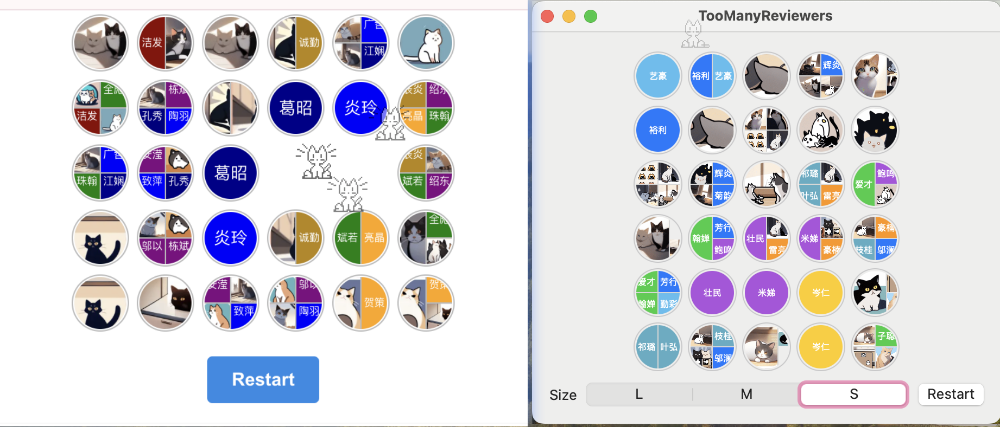

# Too Many Reviewers

A Linkup game making fun of enterprise-level amount of code reviewers. 🐾

The repo contains a web app and a separated Mac app.



## Getting Started

Web app:

```bash
npm run dev
```

Mac app:

Open with Xcode and run.

## But why?

Just for fun. Mainly developed during the Spring Festival 2025 when there was not much continous time to do something else or eat springs (don't you eat springs?), and the network connection is not game-ready. Improved later.

NOT associated with any real experiences and corps. 就图一乐，谢绝无端联想。

## Thanks

- Names are randomly generated based on characters from [姓名学常用汉字大全](http://m.nnn666.com/qiming/200910/374.html) and [百家姓](https://zh.wikipedia.org/wiki/%E7%99%BE%E5%AE%B6%E5%A7%93) at run time

- Avatars were pre-built with [Cagliostro Forge Colab](https://github.com/cagliostrolab/forge-colab)
